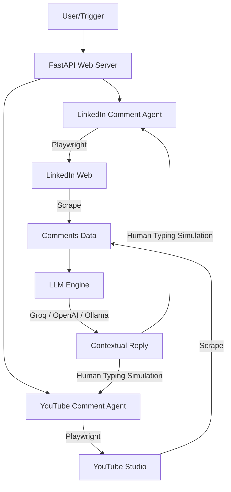

# LinkedIn & YouTube Comment Automation Agent

An enterprise-grade, monorepo automation system that monitors and automatically replies to comments on LinkedIn posts and YouTube Studio channels using Playwright, FastAPI, and LLMs (Groq, OpenAI, Ollama).



---

## 📂 Repository Structure

The repository is structured as a monorepo containing two self-contained automation agents and an interactive dashboard:

```text
.
├── linkedin-comment-agent/     # LinkedIn Automation Agent
│   ├── frontend/               # Next.js web dashboard
│   ├── linkedin_comment_bot/   # Python source code package
│   ├── linkedin_reply_agent.py # Application entry point (CLI/GUI)
│   ├── requirements.txt        # Python dependencies
│   └── README.md               # Detailed LinkedIn agent docs
│
├── youtube-comment-bot/        # YouTube Studio Automation Agent
│   ├── youtube_reply_bot/      # Python source code package
│   ├── youtube_comment_bot.py  # Automation core module
│   ├── main.py                 # FastAPI backend entry point
│   └── requirements.txt        # Python dependencies
│
├── .gitignore                  # Global version control rules
└── README.md                   # Repository entry point (this file)
```

---

## 🚀 Getting Started

### Prerequisites
* Python 3.10 or higher
* Node.js v18+ (only if running the Next.js Dashboard)
* Google Chrome or Chromium installed on the system

---

### 1. LinkedIn Comment Agent (`linkedin-comment-agent`)
An automated agent that logs into LinkedIn, scans post comments, filters spam or offensive messages, and drafts highly tailored professional replies via the Groq LLM API.

#### Setup & Run:
1. Navigate to the directory:
   ```bash
   cd linkedin-comment-agent
   ```
2. Initialize virtual environment & install requirements:
   ```bash
   python -m venv venv
   source venv/bin/activate
   pip install -r requirements.txt
   playwright install chromium
   ```
3. Create and configure your environment file:
   ```bash
   cp .env.example .env
   # Edit .env with your credentials:
   # LINKEDIN_EMAIL, LINKEDIN_PASSWORD, GROQ_API_KEY
   ```
4. Start the Web Dashboard UI (Next.js + FastAPI):
   ```bash
   python linkedin_reply_agent.py --gui
   # Or run via CLI:
   python linkedin_reply_agent.py --post-url "YOUR_POST_URL"
   ```

---

### 2. YouTube Comment Bot (`youtube-comment-bot`)
An automated bot targeting YouTube Studio to detect fresh comments, analyze context, select appropriate reply styles, and submit responses directly via headless browser automation.

#### Setup & Run:
1. Navigate to the directory:
   ```bash
   cd youtube-comment-bot
   ```
2. Initialize virtual environment & install requirements:
   ```bash
   python -m venv venv
   source venv/bin/activate
   pip install -r requirements.txt
   playwright install chromium
   ```
3. Create and configure your environment file:
   ```bash
   cp .env.example .env
   # Edit .env and supply your YouTube channel configurations.
   ```
4. Start the FastAPI API Server:
   ```bash
   python main.py
   ```
5. Run the core bot task:
   ```bash
   python youtube_comment_bot.py
   ```

---

## 🛠️ Development & Contribution

### Git Branching Model
For active maintenance and collaborative updates, the repository uses a two-branch model:
* **`main`**: Production-ready release branch. Only stable, fully-tested features are merged here.
* **`dev`**: Active development branch. All new pull requests, refactors, and feature updates should target `dev`.

#### Creating Feature Branches
Developers should create descriptive feature branches off of the `dev` branch:
```bash
# Switch to the dev branch and pull the latest changes
git checkout dev
git pull origin dev

# Create a new feature branch
git checkout -b feature/your-awesome-feature
```

---

## 🔒 Security Best Practices
* **No Hardcoded Secrets**: Ensure that no API keys (e.g., Groq, OpenAI, YouTube tokens) are hardcoded into Python files. Use environment variables or `.env` files.
* **Ignored Runtime Files**: The repository is pre-configured with a `.gitignore` to prevent leaking sensitive session cookies (`cookies.json`), local Chrome profiles (`test_chrome_profile`), and log files. Keep these rules intact.
